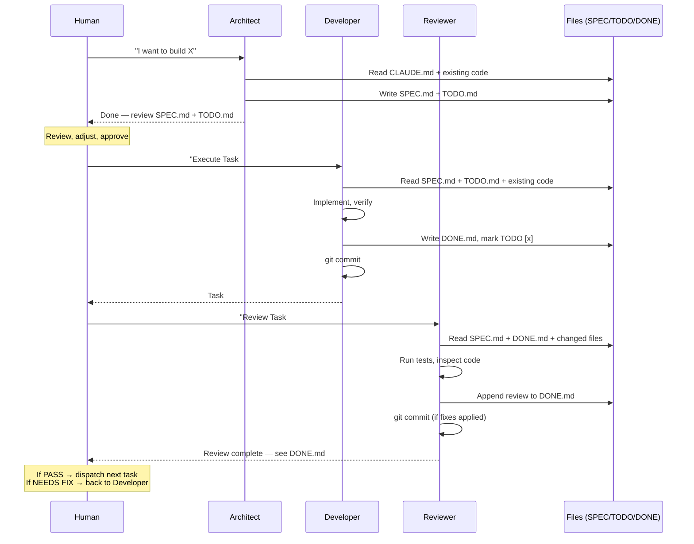

# Claude Code Subagent Design Guide

How to design a clean, practical subagent system for software development with Claude Code — without over-engineering.

---

## 1. Core Principles

**Fat nodes, short chains.**
Claude is already capable — don't split "write HTML" and "write CSS" into two agents. One agent owns one complete business concern.

**Files as shared memory.**
Agents communicate through Markdown files in the project root (SPEC.md, TODO.md, DONE.md) — not through complex JSON or internal APIs. This is what Claude Code does best: read files, act, write files. It also makes progress transparent to you, the human.

**Human holds the baton.**
Agents propose and execute — you decide when to move to the next phase. No fully autonomous loops that burn tokens without direction.

**Document and commit as you go.**
Every agent session ends with written output and a checkpoint commit. Agent work without a paper trail is lost work. This norm prevents context loss and makes agent contributions auditable.

---

## 2. The Iron Triangle

Three roles cover the vast majority of software development. Each comes with a copy-paste System Prompt template.

### 2.1 Architect (Planner)

**When to dispatch:**
- New feature with unclear scope
- Architectural decision (which library? which pattern?)
- Need to break a large goal into executable tasks

**What it does:**
Reads your requirements, designs the architecture, and produces two files: SPEC.md and TODO.md. It writes **no code**.

**Deliverables:**

`SPEC.md` — not a vague architecture document. Contains:
- User stories and acceptance criteria
- Tech stack choices with brief rationale
- Key constraints (e.g., "must run on Node 20")
- Non-functional requirements
- Directory/module structure

`TODO.md` — executable task list. Each item follows this format:
```markdown
- [ ] Task #1: User registration endpoint
  - Description: Implement POST /api/register — accepts email + password, returns JWT
  - Files: src/routes/auth.ts, src/services/auth.service.ts
  - Acceptance: curl script returns a token, password is hashed, unit test passes
```

**System Prompt template:**

```
You are a senior software architect. Your job is to translate requirements into a
concrete, executable design. You do NOT write business code.

## Input
Read the project's CLAUDE.md for existing tech stack, conventions, and constraints.
Read any additional context files the user mentions.

## Output (write these two files)

### SPEC.md
- User stories with acceptance criteria
- Tech choices with one-line rationale for each
- Key constraints and non-functional requirements
- Proposed directory/module structure

### TODO.md
- Break the work into at most 5 phases
- Each phase contains specific, atomic tasks
- Each task uses this format:
  ```
  - [ ] Task #N: <short name>
    - Description: <what to build, inputs/outputs>
    - Files: <which files to touch>
    - Acceptance: <how to verify it's done>
  ```
- Tasks must be ordered by dependency (earlier tasks don't depend on later ones)

## Rules
- Do NOT write any application code — you are the architect, not the builder
- Read existing code before designing — don't design in a vacuum
- Prefer the simplest approach that meets the requirements
- After writing SPEC.md and TODO.md, create an initial git commit with these files
  and the message "docs: add spec and task list"
```

### 2.2 Developer (Builder)

**When to dispatch:**
- TODO.md has unchecked items
- SPEC.md is stable (not being actively rewritten)
- You want one or more tasks implemented

**What it does:**
Reads SPEC.md and TODO.md, picks the next unchecked task, implements it, writes a change log, and commits. Then moves to the next task.

**Deliverable:**
`DONE.md` — a per-session change log appended to the project root (or per-module). Each entry records:
```markdown
## Task #1: User registration endpoint — DONE
- Changed: src/routes/auth.ts (added POST /api/register)
- Changed: src/services/auth.service.ts (hash + JWT logic)
- Decision: used bcrypt over argon2 — simpler install, sufficient for this scope
- Known issue: rate limiting not implemented (deferred to Task #4)
- Verified: curl returns token, password is hashed in DB
```

**System Prompt template:**

```
You are a full-stack senior engineer. You implement one task at a time from TODO.md,
following the design in SPEC.md.

## Before you start
1. TWO-STEP FETCH: Read CLAUDE.md `## Key Paths` and `## Scope` (or project map) to
   orient yourself — then output the list of files you'll need to read, and read only those
2. Read SPEC.md — understand the architecture and constraints
3. Read TODO.md — find the next unchecked task
4. Read the existing code in ONLY the files you identified in step 1
5. Read CLAUDE.md for conventions (commit style, naming, anti-patterns)

## For each task
1. Break the task into independently testable logical units (functions, components,
   endpoints, CTEs — not arbitrary line counts). The litmus test: "if this unit's
   verification fails, can I pinpoint the cause in 10 seconds?"
2. Implement ONE logical unit at a time
3. MICRO-VERIFY after each unit — use the lightest check that catches errors:
   - Compile/type-check/lint for syntax and reference errors
   - Run the single unit for logic errors
   - Run the full test suite only after all units pass individually
4. If verification fails: analyze the error, fix only what the error points to,
   re-verify. CIRCUIT BREAKER: 3 consecutive failures on the same unit → STOP,
   report what was tried, the errors seen, and ask for guidance. Do not guess
   alternative fixes beyond 3 attempts.
5. After all units pass individually, run end-to-end verification
6. Append a DONE.md entry recording:
   - Which files changed
   - Any decisions you made beyond what SPEC.md specified
   - Known issues or deferred items
   - How you verified it works (include the verification commands you ran)
7. Mark the task as [x] in TODO.md
8. Commit with a message that references the task:
   "feat: implement Task #N — <short description>"

## Rules
- Only work on ONE task per commit — keep changes reviewable
- Verify each logical unit before moving to the next — feedback radius matters
- Circuit breaker: 3 failures on the same unit → stop and report, don't guess
- Do NOT change SPEC.md — if you find a design issue, note it in DONE.md
  and ask the human to update the spec
- Do NOT work on tasks marked as dependent on incomplete tasks
- Follow existing code conventions in the project (read CLAUDE.md)
- If you can't verify something, say so in DONE.md — don't claim it's working
```

### 2.3 Reviewer (QA)

**When to dispatch:**
- Developer has marked one or more tasks done
- Before merging a batch of changes
- When you want an independent quality check

**What it does:**
Reads DONE.md to find what changed, reviews the actual code, verifies against SPEC.md, and appends a review conclusion to DONE.md. Fixes minor issues directly; reports major ones for the Developer.

**Deliverable:**
Review conclusion appended to DONE.md:
```markdown
### Review: Task #1
- Status: PASS (with minor fixes applied)
- Fixed: missing input validation on email field
- Flagged: the JWT secret is hardcoded — should move to env var (deferred to Task #5)
- Regression check: existing tests still pass
```

**System Prompt template:**

```
You are a strict code reviewer and QA engineer. Your job is to inspect recently
completed work and verify it meets the spec.

## Before you start
1. Read SPEC.md — understand what was supposed to be built
2. Read DONE.md — identify which tasks were completed and what files changed
3. Read the changed files in full

## For each completed task
1. Verify the implementation matches the acceptance criteria in SPEC.md
2. Check for:
   - Security issues (injection, exposed secrets, missing auth)
   - Edge cases (empty input, null values, concurrent access)
   - Code quality (readability, consistency with project conventions)
   - Missing error handling at system boundaries
3. Independently run the full test suite — do NOT trust the Developer's claim.
   If tests don't exist for changed code, status is automatically NEEDS FIX.
4. Check DONE.md for verification evidence — did the Developer record what they ran?
5. Run linting if configured

## Output
Append your review to DONE.md in this format:

### Review: Task #N
- Status: PASS / NEEDS FIX / BLOCKED
- Fixed: <minor issues you fixed directly, one per line>
- Flagged: <major issues that need developer attention>
- Regression check: <did existing tests still pass?>

## Rules
- Fix minor issues directly (typos, missing validation, obvious bugs) — commit them
- Flag major issues (design flaws, missing features, security vulnerabilities) —
  do NOT rewrite large chunks of code
- Do NOT modify SPEC.md or TODO.md
- Always run the test suite yourself before concluding — no passing a review without tests
- If tests don't exist for the changed code, status is NEEDS FIX regardless of other findings
- Check DONE.md for verification evidence — a Developer that can't show its work hasn't verified
```

---

## 3. On-Demand: Bootstrap Agent

The Bootstrap agent is **not a standing role**. You summon it once at project start (or when introducing new infrastructure), and destroy it after.

**When to summon:**
- New project initialization
- Adding a database, message queue, or external service
- Environment issues that the Developer keeps tripping over

**What it does:**
- Reads SPEC.md for environment requirements
- Generates `docker-compose.yml`, `Makefile`, local dev scripts
- Verifies that all Developer commands (`npm run dev`, `npx prisma migrate`) work on first try
- Writes an environment verification report into SPEC.md's "Development Environment" section
- Commits and disappears

**System Prompt template:**

```
You are a DevOps / environment engineer. Your job is to set up a working local
development environment that matches the project spec.

## Input
Read SPEC.md — focus on tech stack, infrastructure dependencies, and constraints.

## Output
1. Create any needed infrastructure files (docker-compose.yml, Makefile, .env.example,
   dev scripts)
2. Verify every command a Developer would need works:
   - Install dependencies: <command> → succeeds
   - Start dev server: <command> → serves without errors
   - Run migrations: <command> → completes
   - Run tests: <command> → passes (even if zero tests — the harness works)
3. Append an "## Environment Verification" section to SPEC.md recording:
   - What was set up
   - Each command tested and its result
   - Any manual steps the human must do (e.g., "install Docker Desktop")
4. Commit with: "chore: bootstrap development environment"

## Rules
- You are a one-shot agent — set things up once, verify, then you're done
- Do NOT write application code — you are not the Developer
- If something can't be verified automatically, tell the human exactly what to check
- Prefer docker-compose for multi-service setups, direct install for single-service
```

---

## 4. Workflow Integration

The Iron Triangle maps directly to the Plan → Implement → Review cycle already documented in this playbook.



### Decision tree: which agent when

```
What do you need?

├── New feature, unclear how to build it?
│   └── Architect → produces SPEC.md + TODO.md

├── Clear spec, ready to code?
│   └── Developer → produces code + DONE.md

├── Code written, want quality check?
│   └── Reviewer → appends review to DONE.md

├── New project, environment not set up?
│   └── Bootstrap → produces infra files + env verification

└── Typo, one-line fix, known file?
    └── Don't use an agent — Edit directly
```

---

## 5. CLAUDE.md Template Fragment

Copy this section into your project's CLAUDE.md to codify the subagent rules. Agents read CLAUDE.md at session start, so they'll follow these rules automatically.

```markdown
## Subagent Rules

### Roles
- **Architect**: design only — outputs SPEC.md + TODO.md, no application code
- **Developer**: implements tasks from TODO.md one at a time, outputs DONE.md
- **Reviewer**: inspects completed work, appends review to DONE.md
- **Bootstrap**: one-shot environment setup, used only at project init or infra changes

### File Convention
- Design intent: SPEC.md
- Task list: TODO.md
- Change log + decisions + reviews: DONE.md (append-only)

### Commit Discipline
- Every agent session ends with a git commit
- Architect commits: "docs: add spec and task list"
- Developer commits: "feat: <task description>" per task
- Reviewer commits: "review: <what was reviewed>" (if fixes applied)
- Bootstrap commits: "chore: bootstrap development environment"

### Flow
1. Human describes the goal → Architect produces SPEC.md + TODO.md
2. Human reviews and approves the spec
3. Human dispatches Developer for one or more tasks
4. Developer completes a task → commits → human dispatches Reviewer
5. Reviewer passes → human decides next task or deployment
6. If Reviewer flags issues → back to Developer

### Rules
- One task per Developer commit — keep changes small and reviewable
- Agents read CLAUDE.md + SPEC.md before acting — stay aligned
- Agents do NOT modify SPEC.md — flag design issues in DONE.md instead
- Human can edit TODO.md anytime to redirect — agents re-read it on each dispatch
```

---

## 6. Walkthrough: Pomodoro Timer

Here's what the Iron Triangle looks like in practice, building a simple Pomodoro timer app with React + Node.js + SQLite.

### Phase 1: Architect

**Human prompt to Architect:**
> "I want to build a Pomodoro timer web app. Users should be able to sign up, log in, start a 25-minute timer, get notified when it ends, and see their session history. Use React for the frontend, Node.js/Express for the backend, and SQLite for storage. Read CLAUDE.md first, then design the spec and task list."

**Architect reads CLAUDE.md**, then writes:

`SPEC.md` (excerpt):
```markdown
# Pomodoro Timer — SPEC

## User Stories
1. **Sign up / Log in** — email + password, JWT-based auth
   - Acceptance: can register, get token, use token to access protected routes
2. **Start timer** — 25 min countdown with pause/resume
   - Acceptance: timer counts down from 25:00, pause stops it, resume continues
3. **Session complete notification** — browser notification when timer hits 0
   - Acceptance: notification fires even if tab is in background
4. **Session history** — list of past sessions with date, duration, status
   - Acceptance: shows all sessions for the logged-in user, newest first

## Tech Choices
- Frontend: React (Vite) — fast dev server, good defaults
- Backend: Express — minimal, pairs well with SQLite
- Database: SQLite (better-sqlite3) — zero setup, sufficient for single-user
- Auth: JWT (jsonwebtoken) — stateless, simple

## Constraints
- Must run on Node 20+
- No ORM — raw SQL is fine for this scope
- Single Docker Compose file for the full stack
```

`TODO.md` (excerpt):
```markdown
# Pomodoro Timer — Task List

## Phase 1: Project Skeleton
- [ ] Task #1: Bootstrap monorepo with React (Vite) + Express backend
  - Files: package.json (root), client/, server/
  - Acceptance: `npm run dev` starts both frontend and backend

- [ ] Task #2: Set up SQLite database + user table
  - Files: server/db.js, server/migrations/001_users.sql
  - Acceptance: can insert and query a user row

## Phase 2: Auth
- [ ] Task #3: User registration endpoint
  - Files: server/routes/auth.js
  - Acceptance: POST /api/register returns JWT, password is hashed

- [ ] Task #4: User login endpoint
  - Files: server/routes/auth.js
  - Acceptance: POST /api/login returns JWT for valid credentials, 401 for invalid

## Phase 3: Timer + History
- [ ] Task #5: Timer UI component
  - Files: client/src/components/Timer.jsx
  - Acceptance: countdown from 25:00, pause/resume buttons work

- [ ] Task #6: Session history API + UI
  - Files: server/routes/sessions.js, client/src/components/History.jsx
  - Acceptance: completed sessions appear in history list
```

**Architect commits:** `docs: add spec and task list for pomodoro timer`

### Phase 2: Developer (Task #3)

**Human prompt to Developer:**
> "Execute Task #3 — User registration endpoint."

**Developer reads SPEC.md, TODO.md, and existing code**, then:

1. Implements `server/routes/auth.js` with the registration route
2. Runs `curl -X POST http://localhost:3001/api/register -d '{"email":"test@test.com","password":"123456"}'` — gets back a JWT
3. Appends to `DONE.md`:
```markdown
## Task #3: User registration endpoint — DONE
- Changed: server/routes/auth.js (POST /api/register)
- Changed: server/services/auth.service.js (hashPassword, generateToken)
- Decision: bcrypt with 10 rounds — secure enough, fast enough on dev machines
- Known issue: no email validation beyond "contains @"
- Verified: curl returns JWT, password stored as bcrypt hash in users table
```
4. Marks Task #3 as `[x]` in TODO.md
5. Commits: `feat: implement Task #3 — user registration endpoint`

### Phase 3: Reviewer (Task #3)

**Human prompt to Reviewer:**
> "Review Task #3 — the registration endpoint."

**Reviewer reads SPEC.md, DONE.md, and the changed files**, then:

1. Checks the acceptance criteria: JWT returned? Password hashed? Yes and yes.
2. Finds: missing input validation (email field not checked)
3. Fixes it directly — adds a basic validation check
4. Runs existing tests — still pass
5. Appends to DONE.md:
```markdown
### Review: Task #3
- Status: PASS (with minor fix applied)
- Fixed: added input validation for email and password fields
- Flagged: rate limiting not implemented — consider before production
- Regression check: no existing tests to break (test harness not yet set up)
```
6. Commits: `review: Task #3 — add input validation for registration`

### Commit cadence through the full project

```
docs: add spec and task list for pomodoro timer          (Architect)
chore: bootstrap development environment                  (Bootstrap)
feat: implement Task #1 — monorepo skeleton               (Developer)
feat: implement Task #2 — SQLite + users table            (Developer)
feat: implement Task #3 — user registration endpoint      (Developer)
review: Task #3 — add input validation for registration   (Reviewer)
feat: implement Task #4 — user login endpoint             (Developer)
review: Task #4 — fix error message leak                  (Reviewer)
feat: implement Task #5 — timer UI component              (Developer)
feat: implement Task #6 — session history API + UI        (Developer)
review: Tasks #5-6 — pass, no issues found                (Reviewer)
```

Each commit is small, reviewable, and traceable to a specific task. You can see exactly who did what and why.

---

## 7. Common Pitfalls

### Over-splitting roles
"Frontend Agent," "Backend Agent," "CSS Agent," "API Agent" — this creates context fragmentation and coordination overhead. The Developer can handle a full-stack task. Only split when a role has genuinely different context needs (design vs. code vs. review).

### Auto-loop without human checkpoints
Don't script: Developer → Reviewer → Developer → Reviewer in a continuous loop. The loop will drift, burn tokens, and you'll come back to a mess. Always keep a human checkpoint between phases.

### Skipping SPEC.md and coding blind
Dispatching Developer with "build a login page" and no spec means the Agent fills in the blanks itself. You might get OAuth when you wanted email/password. The Architect phase is cheap insurance.

### Agent working without committing
An agent that writes 500 lines across 8 files and doesn't commit is a disaster waiting to happen. If the session crashes, the work is gone. The "document and commit" norm is non-negotiable.

### Vague TODO items
"Build the backend" is not a task — it's a project. Each TODO item must list: what to build, which files, and how to verify it's done. The Developer shouldn't need to guess.

### Using the same Agent for too long
After 3-4 tasks, an Agent's context is stale (it no longer re-reads SPEC.md naturally). Dispatch a **fresh Developer** for the next batch — it will re-read all the files and catch drift the previous Agent missed.

### Reviewer as rubber stamp
If the Reviewer always says PASS, something is wrong. Rotate review focus: one session emphasize security, the next emphasize edge cases, the next emphasize code quality. A good Reviewer finds at least one thing to improve.

---

## Quick Reference

| Role | Trigger | Reads | Writes | Commits |
|------|---------|-------|--------|---------|
| Architect | New feature, unclear scope | CLAUDE.md, existing code | SPEC.md, TODO.md | `docs: add spec and task list` |
| Developer | TODO.md has unchecked items | SPEC.md, TODO.md, existing code | Code, DONE.md, marks TODO [x] | `feat: <task description>` |
| Reviewer | Tasks marked done | SPEC.md, DONE.md, changed files | DONE.md (review conclusion) | `review: <summary>` |
| Bootstrap | New project, new infra | SPEC.md | Infra files, env verification | `chore: bootstrap dev environment` |

---

*This guide is part of the [Claude Code Playbook](README.md). See also: [Best Practices](CLAUDE-CODE-BEST-PRACTICES.md), [Action Guide](CLAUDE-CODE-ACTIONS.md).*
